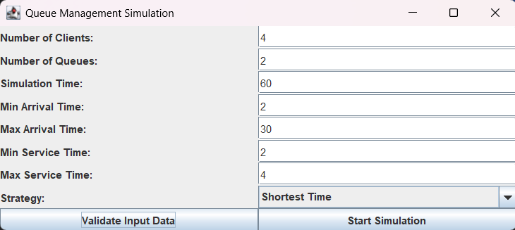
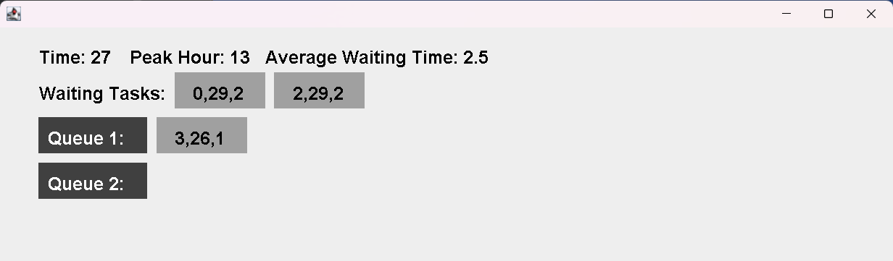

# Queues Management Application

This project simulates a queue management system where multiple clients are assigned to multiple queues using **threads and synchronization mechanisms**. The goal is to minimize waiting time by distributing clients efficiently.

Each client has:

* **ID**
* **Arrival Time**
* **Service Time**

The simulation runs over a defined time interval and processes clients in real-time.

## ⚙️ Features

* Multi-threaded queue processing (each queue = separate thread)
* Dynamic client dispatching based on:

  * Shortest queue
  * Shortest waiting time
* Real-time simulation visualization (Swing GUI)
* Logging of simulation events to file
* Statistics:

  * Peak hour
  * Average waiting time

## 🧱 Project Structure

* **Model**

  * `Task` – represents a client
  * `Server` – queue processor (thread)

* **BusinessLogic**

  * `SimulationManager` – controls simulation flow
  * `Scheduler` – assigns clients to queues
  * `Strategy` – dispatching strategies

* **GUI**

  * `SimulationFrame` – input interface
  * `SimulationView` – live simulation display

## 📊 Output

* Live visualization of queues and waiting clients
* Log file: `simulation_log.txt`
* Final statistics:

  * Peak hour (max load)
  * Average waiting time

## 🧠 Key Concepts

* Multithreading (`Runnable`, `ExecutorService`)
* Synchronization (`synchronized`, `BlockingQueue`)
* Scheduling strategies
* Real-time simulation
